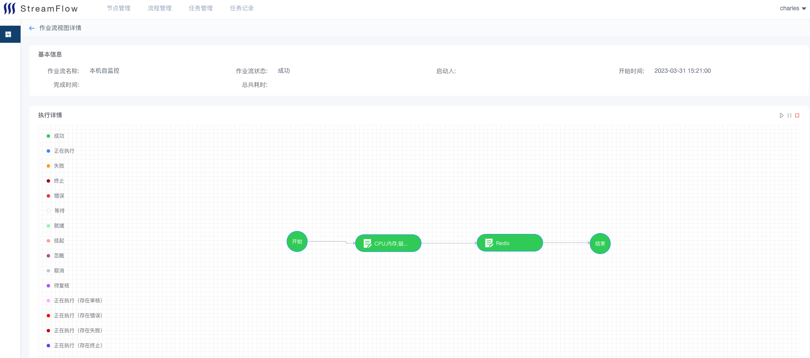
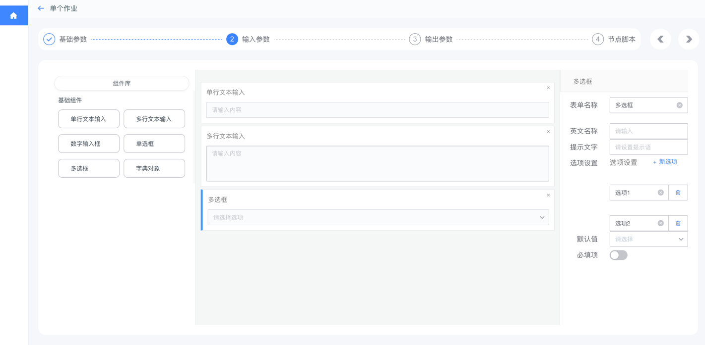
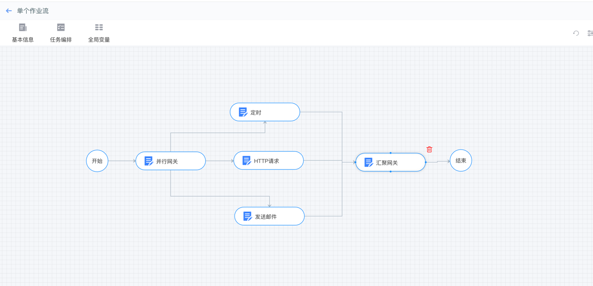

# 任务调度平台
> dj-flow 是通过可视化的图形界面进行任务流程编排和执行的系统，一款轻量级的调度编排软件。
> 
feature：
- 标准节点：支持用户自定义作业节点
- 可视化流程编排：通过拖拽方式组合标准插件节点到一个流程模板。
- 多种流程模式：支持标准插件节点的串行、并行，支持子流程，可以根据全局参数自动选择分支执行，节点失败处理机制可配置。
- 参数引擎：支持参数共享，支持参数替换。
- 可交互的任务执行：任务执行中可以随时暂停、继续、撤销，节点失败后可以重试、跳过。

项目展示：

自定义节点：

流程编排：

任务执行方式：

任务执行情况：

## todo list

 - [x] 条件分支只允许一个正确结果分支提示。

 - [x] 任务管理- 定时任务和周期任务4
 - [ ] 任务管理- 新建任务可选节点
 - [ ] 任务管理- 修改任务
 - [ ] 任务管理- 查看任务详情
 
 - [ ] 作业监视- 暂停，停止，跳过，忽略，等人工干预操作5
 - [ ] 作业监视- 节点重试功能
 - [ ] 作业监视- 搜索过滤功能
 - [ ] 输出报错内容

 - [ ] login
 - [ ] 审核节点
 - [ ] 创建节点需要审核
 - [x] 节点低代码
 - [ ] bug 删除节点脚本一起删
 - [ ] monacoEditor研究

 - [ ] 前端页面风格优化
 - [ ] 没有功能隐藏
 

 
 - ## install tips
sudo apt-get install libmysqlclient-dev python3-dev